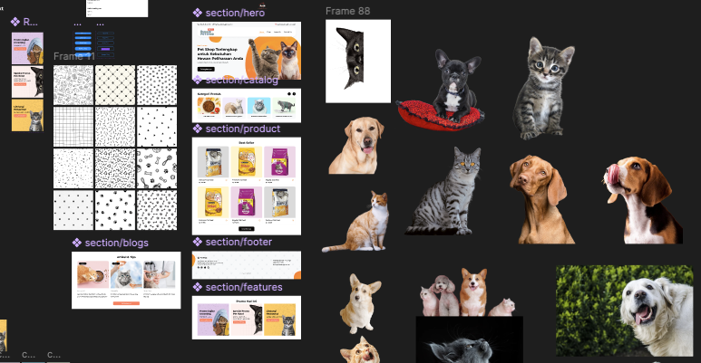

# Creative Landing Page

This repository contains a one-page landing page project built with [Astro](https://astro.build). The goal of this project is to create a visually stunning and clean design for a landing page, showcasing creativity and attention to detail. The design is custom-made using [Figma](https://www.figma.com) and implemented with modern web development practices.


## ✨ Features

- **Custom Design**: The landing page design is fully customized and created in Figma to ensure a unique and creative look.
- **Responsive Layout**: The page is optimized for all devices, including desktops, tablets, and mobile phones.
- **Smooth Navigation**: Includes smooth scrolling animations for a seamless user experience.
- **Clean Code**: Built with Astro for fast performance and maintainability.
- **Modern UI/UX**: Focused on delivering a visually appealing and user-friendly interface.

## 🚀 Project Structure

Inside this project, you'll find the following folders and files:

```text
/
├── public/
│   └── assets/
│       ├── logo.png
│       ├── preview.jpg
│       └── figma.png
├── src/
│   ├── components/
│   │   └── Header.astro
│   ├── layouts/
│   │   └── Layout.astro
│   └── pages/
│       └── index.astro
└── package.json
```

To learn more about the folder structure of an Astro project, refer to [Astro's project structure guide](https://docs.astro.build/en/basics/project-structure/).

## 🛠️ Development Workflow

All commands are run from the root of the project, from a terminal:

| Command                   | Action                                           |
| :------------------------ | :----------------------------------------------- |
| `npm install`             | Installs dependencies                            |
| `npm run dev`             | Starts local dev server at `localhost:4321`      |
| `npm run build`           | Builds the production site to `./dist/`          |
| `npm run preview`         | Previews your build locally before deploying     |
| `npm run astro ...`       | Runs Astro CLI commands like `astro add`         |
| `npm run astro -- --help` | Displays help for Astro CLI                      |

## 🎨 Design Process

The design for this landing page was created in Figma, focusing on:



- **Creativity**: A unique and visually appealing design.
- **Clean Layout**: A minimalistic and organized structure.
- **User Experience**: Ensuring ease of navigation and readability.

